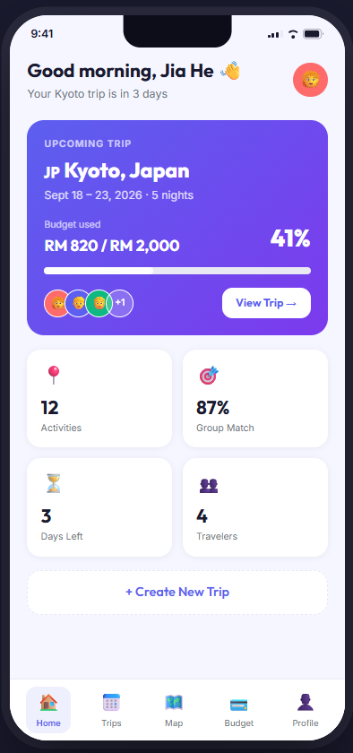
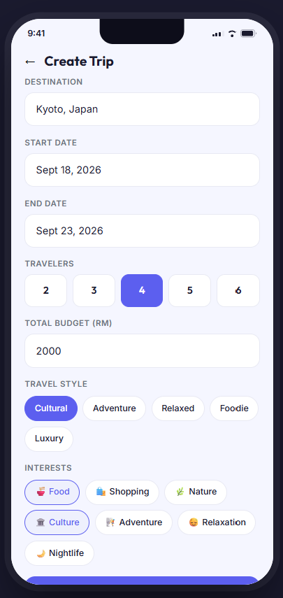
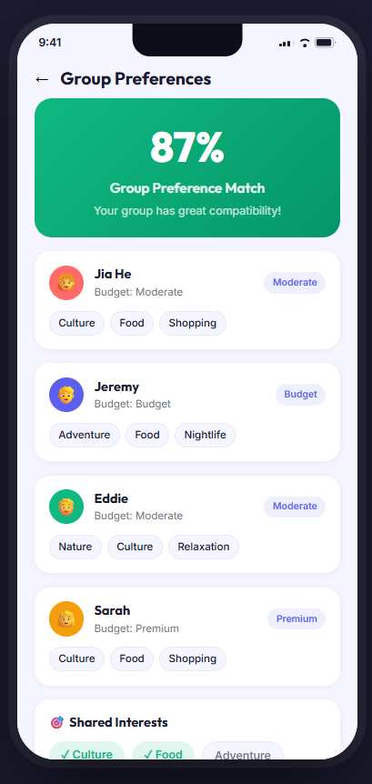
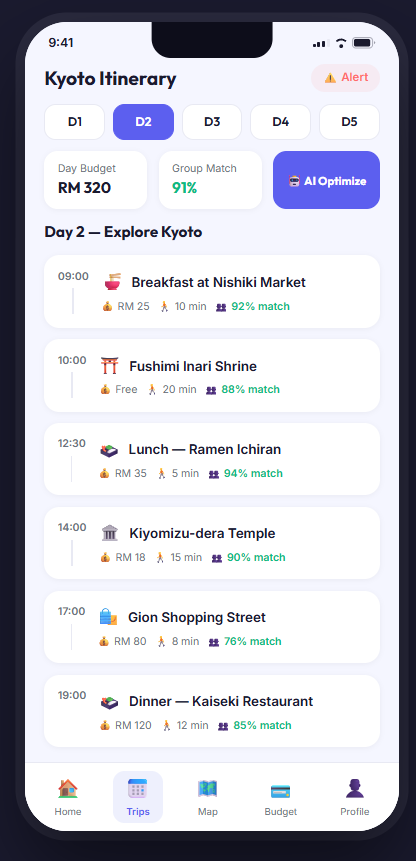
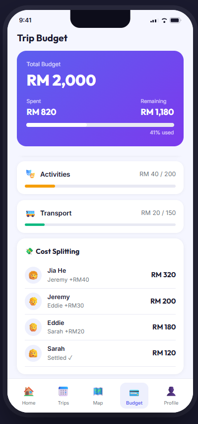
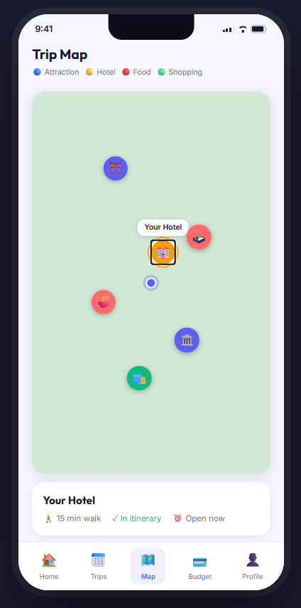
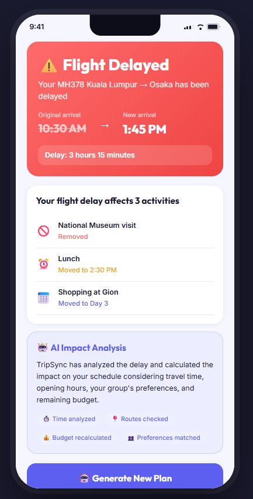
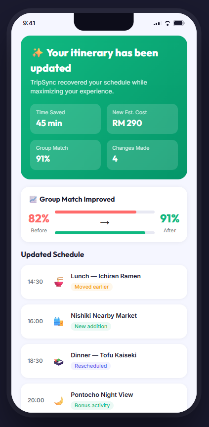

# TripSync by 1+1=3

**Team:** Jeremy Hon Jie En, Goh Jia He, Eddie Chu Lui Hang  
**Problem Statement:** Travel Planner  
**Video Presentation:** [YouTube Link]  
**Presentation Slides:** [Slides Link]

---

# 1. Project Overview

## The Problem

Planning a trip means coordinating flights, accommodation, budgets, activities, travel time, and last-minute changes. This information is often scattered across booking apps, maps, spreadsheets, and group chats.

The problem is even harder for groups. Travellers may have different budgets, interests, and travel styles, so one person usually has to compare everyone's preferences, resolve conflicts, and rebuild the plan whenever something changes. This makes planning slow, stressful, and prone to miscommunication.

Our primary users are friends, families, and small travel groups who want to plan together without placing the entire coordination burden on one person. Solo travellers can also use the itinerary, budget, and disruption-management features.

## Existing Solution

**Wanderlog** is an existing travel planning platform that helps users build itineraries, manage budgets, collaborate with friends, and organise travel information in one place.

**Limitation:** Its collaboration features mainly allow group members to edit and organise the same trip. TripSync goes a step further by combining each member's preferences, showing how well a plan matches the group, identifying conflicts, and recalculating the itinerary when disruptions affect the trip.

## Our Solution

TripSync is an AI-assisted travel planning platform that brings group preferences, itinerary planning, budgeting, maps, and disruption recovery into one experience. Each traveller contributes their budget level, interests, and travel style, after which TripSync creates a plan that balances the whole group. Every activity shows useful decision information such as cost, travel time, and group match. If a delay disrupts the schedule, TripSync identifies the affected activities and proposes an updated plan based on time, routes, opening hours, budget, and group preferences.

### Main Features

- Group preference profiles for each traveller
- Group compatibility score and shared-interest summary
- AI-generated itinerary based on budget, interests, and travel style
- Day-by-day activity timeline with cost, travel time, and match score
- Category-based budget tracking and remaining-budget overview
- Group expense splitting and settlement status
- Interactive trip map with location categories and itinerary status
- Flight-delay impact detection
- AI-assisted itinerary recovery after disruptions
- Before-and-after comparison for time, cost, changes, and group match
- End-of-trip summary with spending, completed activities, satisfaction, and AI replans

---

# 2. Ideation & Process

## 2.1 Ideas We Considered

| Idea | Why it was kept / dropped |
| --- | --- |
| Group travel planner | **Kept** - directly addresses the difficulty of coordinating a trip across several people and apps. |
| Group preference system | **Kept** - allows every traveller's budget, interests, and travel style to influence the plan. |
| Group match scoring | **Kept** - makes preference compatibility visible at both trip and activity level. |
| Budget planning and expense splitting | **Kept** - helps the group stay within its total budget and understand who owes whom. |
| Disruption-aware itinerary recovery | **Kept** - responds to real travel problems by showing affected activities and generating a revised plan. |
| Interactive itinerary map | **Kept** - helps travellers understand routes, walking time, and nearby places. |
| Basic AI itinerary generator | **Dropped as a standalone idea** - generation alone does not solve group decision-making or mid-trip changes. Its useful parts were integrated into the wider TripSync workflow. |
| Full travel booking platform | **Dropped** - flight, hotel, and payment booking would be too broad for the three-week build phase and would distract from the core coordination problem. |

## 2.2 Ideation Boards

### Mindmap / Problem Exploration

The mindmap explores the main causes of travel-planning stress: scattered information, different group preferences, budget conflicts, inefficient routes, and unexpected disruptions. It also connects these problems to the features selected for TripSync.

### User Flow

Our core user flow is:

`Welcome -> Home Dashboard -> Create Trip -> Enter Budget, Travel Style & Interests -> Review Group Preferences -> Generate AI Itinerary -> View Itinerary / Map / Budget -> Receive Disruption Alert -> Generate New Plan -> Accept Updated Itinerary -> Trip Summary`

The most important demo flow is:

`Itinerary -> Flight Delay Alert -> AI Impact Analysis -> Generate New Plan -> Compare Changes -> Accept New Plan -> Trip Summary`

---

# 3. Design & Prototype

## UI Prototype

[View our Figma Prototype](https://www.figma.com/make/DwkKBcvRkc9zLAwL2RwUuz/Prototype?t=Hq002irIQwRbNhxx-20&fullscreen=1)

The mobile-first prototype contains 11 connected screens and demonstrates the complete journey from creating a group trip to recovering from a flight delay.

## Key Screens

### 1. Home Dashboard

The dashboard gives travellers an at-a-glance view of their upcoming trip, budget usage, group members, activity count, group match, and days remaining.

### 2. Create Trip

The organiser enters the destination, dates, number of travellers, total budget, travel style, and interests before inviting the group to contribute preferences.

### 3. Group Preferences

The group can review each member's budget level and interests, see shared interests, and check an overall compatibility score before generating the itinerary.

### 4. AI-Generated Itinerary

TripSync presents a day-by-day timeline in which each activity includes its estimated cost, travel time, and preference-match score, helping users understand why an activity fits the group.

### 5. Budget and Cost Splitting

The budget screen compares spending against category limits, shows the remaining trip budget, and summarises payments and settlements between group members.

### 6. Interactive Trip Map

The map displays colour-coded attractions, hotels, food stops, and shopping locations. Travellers can select a place to view walking time, opening status, and whether it is already included in the itinerary.

### 7. Flight Delay Impact Analysis

When a flight is delayed, TripSync shows the original and new arrival times, identifies affected activities, and explains whether each activity must be removed or rescheduled.

### 8. Re-planned Itinerary and Trip Summary

The recovery screen compares the revised plan with the original, including time saved, estimated cost, number of changes, and group-match improvement. After accepting the plan, travellers receive a summary of spending, completed activities, satisfaction, destinations, and AI-assisted recoveries.

---

# 4. What Makes It Different

## Preference Reconciliation, Not Just Shared Editing

TripSync does more than place several users in the same itinerary. It models each traveller's budget level, interests, and travel style, then displays shared interests and a group compatibility score. Activity-level match scores make the trade-offs visible instead of leaving one organiser to resolve every disagreement manually.

## Explainable Disruption Recovery

When a flight delay occurs, TripSync identifies the exact activities affected and explains what will be removed, moved, or added. The revised plan considers arrival time, travel routes, venue opening hours, remaining budget, and group preferences, so the user sees why the new plan is practical.

## Measurable Before-and-After Improvement

The recovery experience shows concrete outcomes instead of silently replacing the itinerary. Users can compare time saved, estimated cost, number of changes, and group match before accepting the new plan. In the prototype scenario, the revised itinerary improves the group match from 82% to 91%.

## Planning, Coordination, and Recovery in One Flow

Unlike a basic itinerary generator, TripSync supports the full travel-planning journey: collecting group preferences, generating the itinerary, visualising routes, tracking budgets, splitting costs, responding to disruptions, and summarising the trip.

| Capability | Typical itinerary planner | TripSync |
| --- | --- | --- |
| Collaborative trip editing | Yes | Yes |
| Individual preference collection | Limited | Budget, interests, and travel style per member |
| Preference conflict handling | Mostly manual | Group and activity match scores |
| Budget overview | Often available | Category budgets plus group expense splitting |
| Mid-trip disruption support | Mostly manual | Impact analysis and AI-assisted replanning |
| Explanation of itinerary changes | Limited | Affected activities and before/after outcomes |

---

# 5. Technical Architecture & Feasibility

## Current Prototype

The interactive Figma Make prototype is built with **React 19**, **TypeScript**, **Vite**, and **Tailwind CSS 4**. It validates the mobile user experience and the complete end-to-end flow before backend integration.

## Planned Tech Stack

**Frontend: React, TypeScript, Vite, and Tailwind CSS**  
These technologies match the existing prototype, support fast component-based development, and make it practical to create a responsive mobile-first web app within three weeks.

**Backend and Database: Supabase**  
Supabase will provide authentication, a PostgreSQL database, and real-time updates for trips, members, preferences, activities, and shared expenses. Its free tier is suitable for a hackathon demo, although usage limits and network availability must be considered.

**AI Service: OpenAI API**  
The AI layer will turn structured trip constraints into itinerary suggestions and explain proposed changes. The backend will validate its output against budget and schedule rules rather than treating generated text as automatically correct.

**Maps and Places: Google Maps Platform**  
Places, routing, and travel-time data will support location search and itinerary feasibility. To control cost, requests will be cached and restricted to the core demo flow.

**Flight Status: Aviationstack or a similar free-tier flight-status API**  
This service will supply delay information for the disruption flow. If real-time access is too limited for the demo, the team will use a clearly labelled simulated delay event while preserving the same replanning logic.

**Hosting: Vercel**  
Vercel provides straightforward deployment for the frontend and server endpoints, allowing the prototype to be demonstrated on a real device instead of relying on a local development environment.

## Proposed System Flow

`User Interface -> Supabase Auth & Database -> Trip Planning Service -> AI Itinerary Service`

`Trip Planning Service -> Maps / Places API + Flight Status API -> Constraint Validation -> Updated Itinerary -> User Interface`

## Three-Week Build Plan

### Week 1 - Shared Trip Foundation

- Set up the React application, database schema, and deployment pipeline
- Implement trip creation and member joining
- Store each member's budget level, interests, and travel style
- Calculate shared interests and a transparent group-match score

### Week 2 - Planning Experience

- Generate a structured itinerary from group preferences and budget constraints
- Build the day-by-day timeline with cost, travel time, and match information
- Add the category budget dashboard and basic group expense splitting
- Integrate map pins and route/travel-time information for itinerary locations

### Week 3 - Disruption Recovery and Polish

- Implement one complete disruption scenario: a delayed inbound flight
- Detect affected activities and generate a constraint-aware revised plan
- Show before-and-after changes and allow users to accept the new itinerary
- Add the trip summary, error handling, responsive refinement, testing, and final deployment

## MVP Scope

The MVP will support one group trip, preference collection, itinerary generation, budget tracking, map visualisation, expense splitting, and one end-to-end flight-delay recovery flow. The team will not build flight or hotel purchasing, payment processing, a full booking marketplace, offline navigation, or every possible disruption type during the hackathon.

## Key Constraints and Mitigation

- **Limited development time:** prioritise one polished end-to-end flow over many incomplete integrations.
- **AI output reliability:** use structured responses and deterministic validation for dates, costs, opening hours, and schedule conflicts.
- **Third-party API limits:** cache results, monitor quotas, and prepare labelled demo data for unstable services.
- **Three-person team:** divide ownership among frontend/UX, backend/data, and integrations/testing while reviewing the core flow together.
- **Scalability:** model trips, members, preferences, expenses, and activities as separate records so the platform can later support more destinations, disruption types, and larger groups.

---

TripSync turns group travel planning from a scattered, manual coordination task into a shared decision-making process that can adapt when the real trip no longer follows the original plan.
